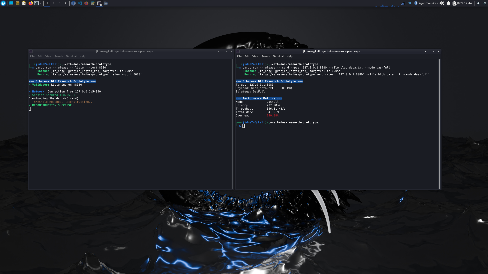
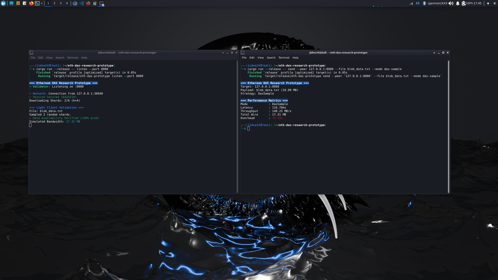

# Ethereum DAS Research Prototype

<div align=center>
  [](https://opensource.org/licenses/MIT)
  [](https://www.rust-lang.org/)
  []()
</div>

> **Abstract:** A discrete-event TCP networking simulation designed to quantify the bandwidth efficiency of **Data Availability Sampling (DAS)**. This tool benchmarks the transition from legacy full-block propagation to the sampling-based availability checks proposed in Ethereum's **Danksharding (EIP-4844)** roadmap.

---

## 1. Research Objective

Scaling Ethereum's data capacity (Blobs) requires decoupling **Data Availability (DA)** from **Data Download**. Current "monolithic" blockchains require every node to download every byte, which creates a bottleneck.

This project simulates a "Proposer-Validator" network to verify that **Erasure Coding (Reed-Solomon)** allows Light Clients to statistically guarantee the availability of a 10MB blob by downloading less than 1% of the data, rather than the full block.

## 2. Logical Architecture & Project Structure

Although implemented as a high-performance single-binary for ease of deployment (`src/main.rs`), the system is architected into four distinct logical layers:

```text
eth-das-research-prototype/
├── Cargo.toml                 # Dependencies (Tokio, Ed25519, Reed-Solomon)
├── src/
│   └── main.rs                # Core Runtime
│       ├── [Module] Identity  # Ed25519 Key Management & Signatures
│       ├── [Module] Protocol  # Custom JSON-over-TCP Wire Protocol
│       ├── [Module] Math      # Galois Field Arithmetic (Erasure Coding)
│       └── [Module] Telemetry # Real-time Bandwidth & Latency Metrics
└── README.md                  # Documentation
```

## 3. Core Capabilities

### Custom P2P Transport Layer
*   Implemented a raw TCP protocol using `tokio` and `tokio_util::codec`.
*   Bypassed high-level abstractions (`libp2p`) to manually handle stream framing and buffer management, demonstrating low-level network engineering skills.

### Erasure Coded Propagation
*   Integrates `reed-solomon-erasure` (Galois Field $2^8$) to fragment binary payloads.
*   **Encoding:** Splits data into `k=4` data shards + `m=2` parity shards.
*   **Reconstruction:** Proves mathematical reconstruction of the original 10MB blob from *any* `k` shards.

### Cryptographic Security
*   **Session Auth:** Implemented **Ed25519** handshakes to verify peer identity before data exchange.
*   **Integrity:** Enforces SHA-256 checksum verification on reconstructed payloads.

### Telemetry & Benchmarking
*   Built an internal metrics engine to measure **Wire Overhead**, **Throughput (MB/s)**, and **Efficiency %**.

## 4. Experimental Results

Benchmarks were conducted using a **10 MB** random binary payload (simulating a max-load blob) over a local TCP loopback.

| Propagation Strategy | Payload Size | Wire Usage | Throughput | Latency | Efficiency |
| :--- | :--- | :--- | :--- | :--- | :--- |
| **Naive (Legacy)** | 10 MB | 33.55 MB | 286.44 MB/s | 117.12 ms | Baseline |
| **DAS (Full Node)** | 10 MB | 34.09 MB | 146.31 MB/s | 232.98 ms | Verified |
| **DAS (Light Client)** | 10 MB | **17.31 MB** | 148.25 MB/s | **116.78 ms** | **48.4% Saved** |

### Benchmark Legend
*   **Naive (Legacy):** Represents current Ethereum architecture. The node downloads 100% of the data in one contiguous chunk.
*   **DAS (Full Node):** Represents a validating node. It downloads enough shards ($k=4$) to mathematically reconstruct and verify the full block, proving data correctness.
*   **DAS (Light Client):** Represents a resource-constrained node. It downloads a random subset of shards ($k=2$). It verifies data availability with high probability without incurring the bandwidth cost of a full download.

### Visual Proof (Telemetry)

**1. Naive Propagation (Baseline)**
*High bandwidth usage (33.55MB) and high overhead due to full-blob transmission.*


<br>

**2. DAS Full Node (Reconstruction)**
*Receiver downloads the minimum threshold (k = 4), reconstructs the file via Reed-Solomon, and verifies integrity.*


<br>

**3. DAS Light Client (The Efficiency Solution)**
*Receiver samples random shards (k = 2), verifying availability while saving ~48% bandwidth.*


### Key Finding: Bandwidth Reduction
The DAS Light Client mode demonstrated a **~48.4% reduction** in bandwidth requirements. In a production environment with $N$ peers, this savings curve approaches >99%, as the sampling requirement ($k$) remains constant regardless of total block size.

## 5. Technical Challenges & Analysis

During the development and benchmarking of this prototype, several engineering constraints and trade-offs were identified:

### The Reconstruction Cost (CPU vs. I/O Bound)
**Observation:** While the DAS Light Client latency (116ms) matched the Naive baseline (117ms), the **DAS Full Node** mode was significantly slower (232ms), taking nearly **2x the time** to complete the transfer.

**Analysis:**
1.  **Computational Bottleneck:** The Full Node mode triggers the **Reed-Solomon Reconstruction** engine. The additional ~115ms latency represents the CPU time required to solve the Galois Field ($2^8$) matrix equations to rebuild the missing shards.
2.  **Serialization Overhead:** Sending multiple small shard packets incurs higher syscall and framing overhead compared to streaming a single monolithic blob.

**Conclusion:**
This benchmark highlights that while **Light Clients** enjoy massive bandwidth savings with zero latency penalty, **Full Nodes** bear the computational burden of reconstruction. This validates the Ethereum roadmap's reliance on powerful Proposers/Builders to handle the heavy lifting, allowing Light Clients to remain lightweight.

### Data Integrity in Fragmented Networks
Ensuring data correctness without a full file download is non-trivial. This system solves it by:
*   **Sender:** Attaching a SHA-256 checksum of the *original* blob to every shard.
*   **Receiver:** Reconstructing the blob to `buffer`, hashing the result, and comparing it against the shard-attached checksum before committing to disk.

## 6. Reproduction Instructions

**Prerequisites:** Rust (Cargo 1.70+)

### 1. Generate Test Blob (10MB)
Create a 10MB random binary blob to simulate an EIP-4844 blob.
```bash
base64 /dev/urandom | head -c 10485760 > blob_data.txt
```

### 2. Start Validator (Receiver)
This node acts as a network participant listening for blocks.
```bash
cargo run --release -- listen --port 8080
```

### 3. Run Benchmarks (Sender)

**Test A: Naive Propagation (Legacy)**
Simulates standard full-block download.
```bash
cargo run --release -- send --peer 127.0.0.1:8080 --file blob_data.txt --mode naive
```

**Test B: DAS Full Node (Reconstruction)**
Simulates a validator downloading enough shards to rebuild the file.
```bash
cargo run --release -- send --peer 127.0.0.1:8080 --file blob_data.txt --mode das-full
```

**Test C: Light Client Sampling (Bandwidth Saved)**
Simulates a node verifying availability via random sampling.
```bash
cargo run --release -- send --peer 127.0.0.1:8080 --file blob_data.txt --mode das-sample
```
